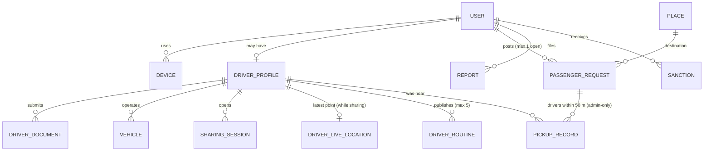
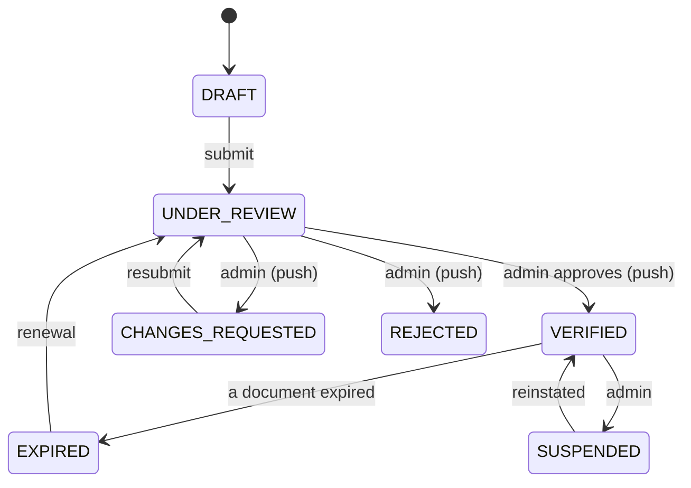
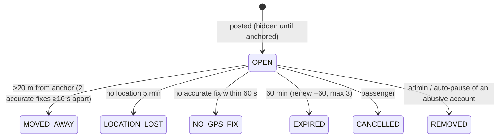

# Domain Model v3.1

> PostgreSQL 16 + PostGIS. IDs are UUIDv7; timestamps UTC `timestamptz`; points `geography(Point,4326)`.

## 1. Entities

### Identity
- **users**: `id`, `google_sub` (unique; cleared on a normal deletion), `apple_sub` (unique, later), `email` (private), `display_name`, `locale`, `status` (`ACTIVE`|`SUSPENDED`|`BANNED`|`DELETED`), `is_admin` (from `ADMIN_EMAILS` at sign-in), `role?` (`PASSENGER`|`DRIVER`, chosen once, ADR-225), `terms_accepted_version`, `terms_accepted_at`, `created_at`, `updated_at`, `deleted_at`.
- **devices**: `id`, `user_id`, `install_id` (random per-install UUID), `platform`, `push_token`, `app_version`, `last_seen_at`, `created_at`. Unique (`user_id`, `install_id`).
- **sessions** (one row per refresh token, ADR-214): `id`, `user_id`, `device_id`, `family_id` (= the logical session), `refresh_token_hash` (SHA-256, unique), `expires_at`, `rotated_at`, `revoked_at`, `revoke_reason`, `created_at`.

### Drivers
- **driver_profiles**: `user_id` PK, legal names, `cin_hmac` (unique), `cin_last4`, `cin_encrypted`, `public_photo_key`, `status`, `submitted_at`, `reviewed_by`, `reviewed_at`, `decision_reason`, **`cooldown_until`**, document expiry dates.
- **driver_documents**: `id`, `driver_user_id`, `type` (`CIN_FRONT`|`CIN_BACK`|`SELFIE`|`DRIVING_LICENCE`|`PROFESSIONAL_CARD`|`VEHICLE_REGISTRATION`|`INSURANCE`|`OPERATING_CARD`|`OPERATOR_AUTHORISATION`|`VEHICLE_PHOTO`), `storage_key`, `sha256`, `content_type`, `size_bytes`, `status` (`PENDING`|`ACCEPTED`|`REJECTED`), `reason`, `expires_on`, `reminded_at`, `created_at`, `reviewed_at`.
- **vehicles**: `id`, `driver_user_id` (one vehicle per driver for now), `transport_type` (`TAXI`|`LOUAGE`|`BUS`), `plate_normalized` (unique; Arabic/Latin spellings collapse), `plate_display`, `seats` (from the type: taxi 4, louage 8, bus null; ADR-216).
- **transport_types**: `code`, names, `can_share` (all true), `can_be_requested` (TAXI, LOUAGE true; BUS false), `required_documents[]`.

Driver verification status:

Once `VERIFIED`, the account is **driver-only** (no passenger mode).

### Sharing
- **sharing_sessions**: `id`, `driver_user_id`, `vehicle_id`, `transport_type`, `heading_to_place_id?` (a known place, ADR-218), `line_label?` (bus), `state` (`SHARING`|`ON_BREAK`|`ENDED`), **`is_full`** (bool), `break_started_at?`, **`break_until?`**, `break_reminded_at?`, `breaks_count`, `started_at`, `last_fix_at`, `still_working_prompted_at?`, `still_working_confirmed_at?`, `ended_at?`, `end_reason?` (`MANUAL_STOP`|`LOCATION_OFF`|`PING_GAP`|`SPOOF_SUSPECTED`|`MAX_DURATION`|`BREAK_NOT_RESUMED`|`SUSPENDED`|`ADMIN`), `cooldown_applied` (bool).
- **session_events** (audit trail of the session, no coordinates): `session_id`, `type` (`STARTED`|`FULL_ON`|`FULL_OFF`|`BREAK_STARTED`|`RESUMED`|`HEADING_CHANGED`|`STILL_WORKING_PROMPTED`|`STILL_WORKING_CONFIRMED`|`ENDED`), `at`, `meta` jsonb (e.g. break minutes, end reason).
  Partial unique index: one session per driver `WHERE ended_at IS NULL`.
- **driver_live_locations** (hot, one row per sharing driver; deleted at break start and session end; **no history table**): `driver_user_id` PK, `session_id`, `transport_type`, `point` (GiST), `lat`, `lng`, `accuracy_m`, `heading_deg`, `speed_mps`, `fix_ts`, `recent_fixes` jsonb (a rolling window of the last `driver_fresh_s`, overwritten), `updated_at`.
- **driver_profiles.cooldown_until**: no "Start sharing" before it (ADR-218: a `PING_GAP` counts from the last good fix).

```mermaid
stateDiagram-v2
  [*] --> NOT_SHARING
  NOT_SHARING --> SHARING: start (verified, now ≥ cooldown_until)
  SHARING --> SHARING: toggle Full / Available (no penalty)
  SHARING --> ON_BREAK: break 30 / 60 / 120 min
  ON_BREAK --> SHARING: resume (only after break_until, within 15 min)
  ON_BREAK --> SHARING: break time over → resumes by itself (ADR-227), no cooldown
  SHARING --> NOT_SHARING: MANUAL_STOP / LOCATION_OFF / PING_GAP / SPOOF_SUSPECTED → cooldown 1 h
  SHARING --> NOT_SHARING: MAX_DURATION (12 h unanswered) / SUSPENDED / ADMIN → no cooldown
  ON_BREAK --> NOT_SHARING: MANUAL_STOP → cooldown 1 h; MAX_DURATION / SUSPENDED / ADMIN → no cooldown
```

### Routine routes
- **driver_routines**: `id`, `driver_user_id`, `transport_type`, `from_place_id`, `to_place_id` (known places, ADR-219), `schedule_kind` (`ONE_OFF`|`WEEKLY`), `one_off_at?`, `days_mask?` (Mon=1…Sun=64), `local_time?` (Tunis-local "HH:MM"), `seats?`, `note?` (≤ 80), `active` (bool), `last_used_at?` (the last sharing session matching it, or the last "still running" answer), `stale_prompted_at?`, `hidden_at?`, `created_at`, `updated_at`.
  Max 5 routines per driver. One-off routines are over once their time has passed. A CHECK keeps each kind's fields consistent.

### Passengers
- **passenger_requests**: `id`, `passenger_user_id`, `transport_types[]` (⊆ {TAXI, LOUAGE}, non-empty), `destination_point` (+ lat/lng), `destination_place_id?`, `seats` (1–8), `note?` (≤ 80), **`show_identity`** (bool, default **false**: name and note hidden from drivers unless true), `status`, `anchor_point?` (+ lat/lng, `anchor_accuracy_m`), `visible_at?`, `last_point?` (+ lat/lng, `last_accuracy_m`, `last_fix_at`), `last_ping_at?`, `away_since?`, `created_at`, `expires_at`, `expiry_reminded_at?`, `renew_count`, `closed_at?`.
  **Partial unique index `(passenger_user_id) WHERE status = 'OPEN'`** → one open request per passenger.

- **pickup_records** (**admin-only**): `request_id`, `driver_user_id`, `min_distance_m`, `recorded_at`. PK (`request_id`, `driver_user_id`). Created automatically when a request closes `MOVED_AWAY`, for **every** sharing driver within 50 m of the anchor during the last 2 min. Never exposed through user-facing endpoints; admin reads are audited.

### Places
- **places**: `id`, `kind` (GOVERNORATE · DELEGATION · CITY · NEIGHBOURHOOD · LOUAGE_STATION · BUS_STATION · TAXI_STATION · AIRPORT · LANDMARK), `name_ar`, `name_fr`, `aliases[]`, `location` geography(Point,4326) (GiST), `parent_id`, `governorate_code`, `popularity` 0–100, `source` (unique provenance: `osm:<type>/<id>` or `admin:<id>`), `search_text` (all names folded by `normalizeSearchText`, pg_trgm GIN), `locked` (edited by an admin → skipped by re-imports), `created_at`, `updated_at`.
  Public reference data, not personal. Imported from `data/places/tn-places.json` by `pnpm db:seed` (upsert by `source`); search and pick-on-map take coordinates in POST bodies only (ADR-217).

### Trust & ops
- **reports**: `id`, `reporter_user_id`, `target_user_id?` (null for reports from history: the admin identifies the person through the pick-up records), `source` (`DRIVER_MARKER`|`PASSENGER_MARKER`|`MY_REQUEST`|`MY_SESSION`), `category` (`NOBODY_THERE`|`FAKE_PROFILE`|`HARASSMENT`|`UNSAFE`|`SPAM`|`OTHER`), `priority` (`HIGH` for UNSAFE/HARASSMENT, else `NORMAL`), `description`, `request_id?`, `session_id?`, `approx_at?` (session reports), `status` (`OPEN`|`ACTIONED`|`DISMISSED`), `resolution_note?`, `handled_by?`, `handled_at?`, `created_at`.
- **sanctions**: `id`, `user_id`, `type` (`WARNING`|`REQUEST_PAUSE`|`SUSPENSION`|`BAN`), `reason` (shown to the person), `starts_at`, `ends_at?` (pause 24 h, suspension 1–365 days, ban none), `created_by?` (null = automatic, `REQUEST_PAUSE` only; otherwise an admin), `report_id?`, `revoked_at?`, `revoked_by?`, `revoke_reason?`. `users.status` always follows the suspensions and bans in force (`statusFromSanctions`); a 5-minute job gives expired suspensions back.
- **blocks**: `id`, `blocker_user_id`, `blocked_user_id` (unique pair, not self), `kind` (`DRIVER`|`PASSENGER`), `label?` (the driver's public name, or the passenger's name only if they had shown it), `created_at`. Either direction hides both people from each other's map and finder (R-027).
- **appeals** (R-073, the contact form): `id`, `user_id`, `sanction_id?`, `message`, `status` (`OPEN`|`CLOSED`, one OPEN per user), `handled_by?`, `handled_at?`, `created_at`.
- **risk_flags**: `id`, `user_id`, `type` (`MOCK_LOCATION`|`IMPOSSIBLE_JUMP`|`MULTI_ACCOUNT_DEVICE`|`NOBODY_THERE_CLUSTER`|`REPORTS_CLUSTER`), `session_id?`, `request_id?`, `evidence` jsonb (measurements such as speed, interval or reporter counts, never coordinates), `created_at`, `reviewed_at?`, `reviewed_by?`.
- **client_errors** (crash reports, ADR-223): `id`, `fingerprint`, `name`, `message`, `stack?`, `screen?`, `fatal`, `install_id`, `platform`, `app_version`, `occurred_at`, `received_at`. Scrubbed twice, no user id, no position; 90 days.
- **notifications**, **audit_logs** (insert-only).

## 2. Invariants (each covered by a test)
1. At most **one OPEN request per passenger** (DB partial unique index).
2. Requests only for TAXI/LOUAGE; never BUS.
3. A verified driver account cannot create passenger requests.
4. Driver-feature endpoints (map with exact passengers, driver list) require an active session with a fix < 2 min old → otherwise 403 `SHARING_REQUIRED`.
5. `start sharing` fails while `now() < cooldown_until`.
6. Exact passenger coordinates are serialised only to sharing (not on break) taxi/louage drivers of a matching type, and never after the request closes. Passenger **name and note** are serialised only when `show_identity = true`, and only to those drivers.
9. Driver name is always included in driver markers for every viewer.
10. `pickup_records` are readable only through admin endpoints (a test asserts that no user route exposes them).
11. A break cannot end before `break_until` (no endpoint allows it); fixes during `ON_BREAK` are discarded.
12. Routine routes can be created/edited without sharing; max 5 per driver.
7. Location fixes are stored only as the latest point (+ the 2-min rolling window for drivers). There is no history table.
8. Pings with no active mode are rejected with `stop: true` and not stored.

## 3. Configurable thresholds (admin "Content → thresholds")
`move_away_m=20`, `move_away_min_accuracy_m=25`, `move_away_confirm_s=10`, `anchor_max_accuracy_m=30`, `anchor_timeout_s=60`, `location_lost_min=5`, `request_ttl_min=30`, `request_max_renewals=0`, `request_expiry_reminder_min=10`, `request_daily_limit_new=5`, `request_daily_limit=15`, `request_new_account_days=3`, `passenger_ping_s=5`, `passenger_distance_filter_m=3`, `passenger_buffer_max_min=5`, `driver_fresh_s=120`, `driver_buffer_max_min=60`, `ping_gap_s=120`, `driver_ping_moving_s=10`, `driver_ping_stationary_s=30`, `driver_distance_filter_m=10`, `cooldown_min=60`, `break_options_min=[30,60,120]`, `session_max_h=12`, `still_working_answer_min=10`, `routine_max=5`, `routine_stale_days=30`, `routine_prompt_grace_days=7`, `routine_prefill_window_min=60`, `pickup_radius_m=50`, `spoof_speed_kmh=180`, `approx_grid_m=100`, `map_max_span_km=25`, `map_cluster_cells=8`, `finder_near_urban_m=2000`, `finder_near_intercity_m=10000`, `finder_corridor_urban_m=1000`, `finder_corridor_intercity_m=5000`, `finder_radius_taxi_m=5000`, `finder_radius_intercity_m=15000`, `finder_routine_m=15000`, `report_daily_limit=10`, `nobody_there_reports=3`, `nobody_there_window_days=7`, `request_pause_h=24`, `report_flag_count=3`, `report_flag_window_days=7`, `device_max_accounts=2`, `device_window_days=30`, `pickup_retention_days=90`, `request_coarsen_days=30`, `request_coarse_grid_m=1000`, `session_retention_days=365`, `client_error_retention_days=90`, `destination_snap_m=20`, `document_expiry_reminder_days=30`.

## 4. Retention (proposed; confirm with a lawyer)
| Data | Retention |
|---|---|
| Driver live location (+ rolling window) | While sharing only; deleted at session end |
| Request anchor/last point | 30 days, then coarsened (~1 km cell centre + place IDs; `coarsened_at`) |
| Pickup records (admin-only) | 90 days (longer if linked to an open report) |
| Session events (no coordinates) | 12 months |
| Sharing sessions metadata (no coordinates) | 12 months |
| Verification document images | Decision + 30 days, then purge (keep metadata); **confirm** |
| Audit logs | 24 months |
