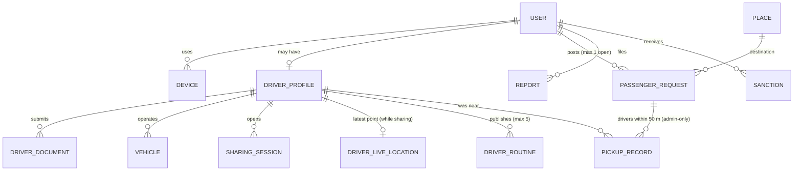
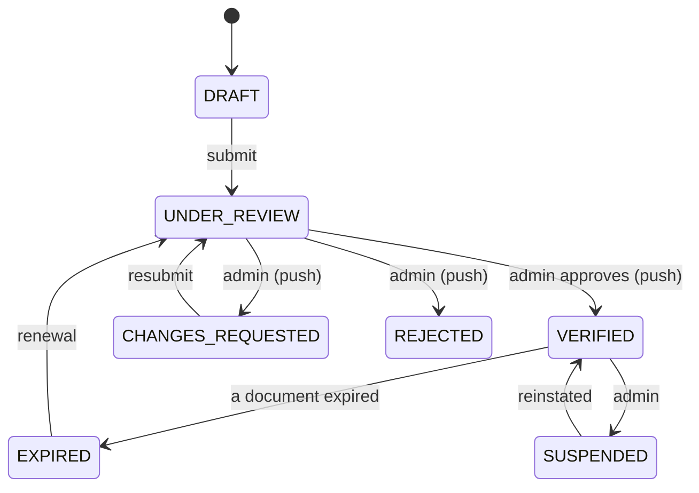
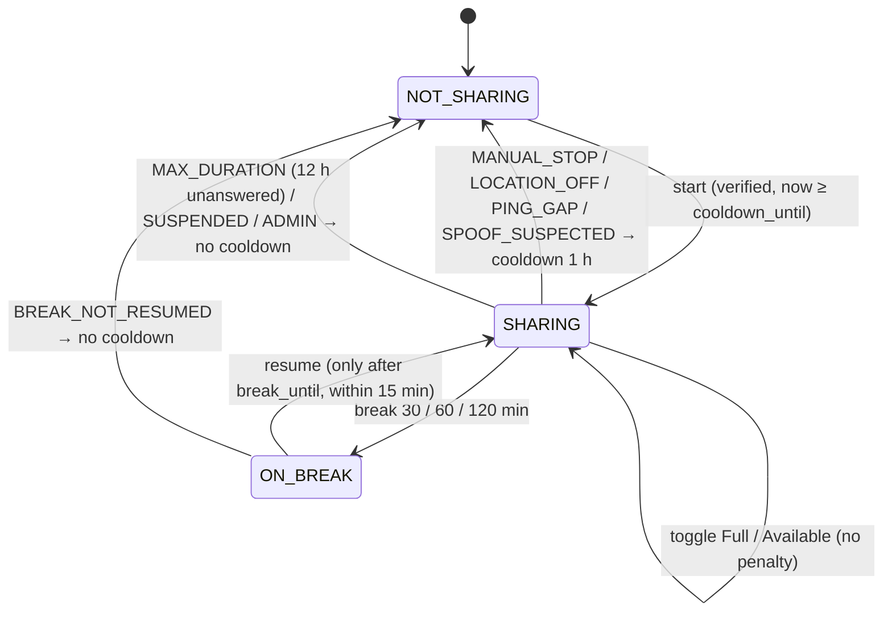
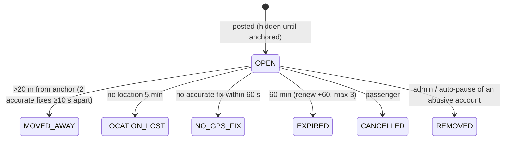

# Domain Model v3.1

> PostgreSQL 16 + PostGIS. IDs are UUIDv7; timestamps UTC `timestamptz`; points `geography(Point,4326)`.

## 1. Entities

### Identity
- **users**: `id`, `google_sub` (unique; cleared on a normal deletion), `apple_sub` (unique, later), `email` (private), `display_name`, `locale`, `status` (`ACTIVE`|`SUSPENDED`|`BANNED`|`DELETED`), `is_admin` (from `ADMIN_EMAILS` at sign-in), `terms_accepted_version`, `terms_accepted_at`, `created_at`, `updated_at`, `deleted_at`.
- **devices**: `id`, `user_id`, `install_id` (random per-install UUID), `platform`, `push_token`, `app_version`, `last_seen_at`, `created_at`. Unique (`user_id`, `install_id`).
- **sessions** (one row per refresh token, ADR-214): `id`, `user_id`, `device_id`, `family_id` (= the logical session), `refresh_token_hash` (SHA-256, unique), `expires_at`, `rotated_at`, `revoked_at`, `revoke_reason`, `created_at`.

### Drivers
- **driver_profiles**: `user_id` PK, legal names, `cin_hmac` (unique), `cin_last4`, `cin_encrypted`, `public_photo_key`, `status`, `submitted_at`, `reviewed_by`, `reviewed_at`, `decision_reason`, **`cooldown_until`**, document expiry dates.
- **driver_documents**: `id`, `driver_user_id`, `vehicle_id?`, `type`, `storage_key`, `sha256`, `status`, `reason`, `expires_on`.
- **vehicles**: `id`, `driver_user_id`, `transport_type_code` (`TAXI`|`LOUAGE`|`BUS`), `plate_normalized` (unique), `plate_display`, `model`, `color`, `seats`, `status`.
- **transport_types**: `code`, names, `can_share` (all true), `can_be_requested` (TAXI, LOUAGE true; BUS false), `required_documents[]`.

Driver verification status:

Once `VERIFIED`, the account is **driver-only** (no passenger mode).

### Sharing
- **sharing_sessions**: `id`, `driver_user_id`, `vehicle_id`, `transport_type_code`, `heading_to_place_id?`, `heading_to_point?`, `heading_to_label?`, `line_label?` (bus), `state` (`SHARING`|`ON_BREAK`), **`is_full`** (bool), `break_started_at?`, **`break_until?`**, `breaks_count`, `started_at`, `last_fix_at`, `still_working_confirmed_at?`, `ended_at?`, `end_reason?` (`MANUAL_STOP`|`LOCATION_OFF`|`PING_GAP`|`SPOOF_SUSPECTED`|`MAX_DURATION`|`BREAK_NOT_RESUMED`|`SUSPENDED`|`ADMIN`), `cooldown_applied` (bool).
- **session_events** (audit trail of the session, no coordinates): `session_id`, `type` (`STARTED`|`FULL_ON`|`FULL_OFF`|`BREAK_STARTED`|`RESUMED`|`HEADING_CHANGED`|`HIDDEN_STALE`|`ENDED`), `at`, `meta` jsonb (e.g. break minutes).
  Partial unique index: one session per driver `WHERE ended_at IS NULL`.
- **driver_live_locations** (hot, one row per sharing driver; deleted at session end; **no history table**): `driver_user_id` PK, `session_id`, `transport_type_code`, `point`, `accuracy_m`, `heading`, `speed_mps`, `fix_ts`, `recent_fixes` jsonb (a rolling window of the last ~2 min, overwritten), `updated_at`. GiST on `point`.

### Routine routes
- **driver_routines**: `id`, `driver_user_id`, `vehicle_id`, `transport_type_code`, `from_place_id`, `from_point`, `from_label`, `to_place_id`, `to_point`, `to_label`, `schedule_kind` (`ONE_OFF`|`WEEKLY`), `one_off_at?`, `days_mask?` (Mon=1…Sun=64), `local_time?` (Africa/Tunis), `seats?`, `note?`, `active` (bool), `last_used_at?` (the last sharing session matching it), `stale_prompted_at?`, `hidden_at?`, `created_at`.
  Max 5 non-deleted routines per driver. One-off routines auto-deactivate after their time.

### Passengers
- **passenger_requests**: `id`, `passenger_user_id`, `transport_types[]` (⊆ {TAXI, LOUAGE}, non-empty), `destination_point`, `destination_place_id`, `destination_label`, `seats`, `note`, **`show_identity`** (bool, default **false**: name and note hidden from drivers unless true), `status`, `anchor_point?`, `anchor_accuracy_m?`, `visible_at?`, `last_point?`, `last_accuracy_m?`, `last_ping_at?`, `away_since?`, `created_at`, `expires_at`, `renew_count`, `closed_at?`.
  **Partial unique index `(passenger_user_id) WHERE status = 'OPEN'`** → one open request per passenger.

- **pickup_records** (**admin-only**): `request_id`, `driver_user_id`, `min_distance_m`, `recorded_at`. PK (`request_id`, `driver_user_id`). Created automatically when a request closes `MOVED_AWAY`, for **every** sharing driver within 50 m of the anchor during the last 2 min. Never exposed through user-facing endpoints; admin reads are audited.

### Places
- **places**: `id`, `kind`, `name_ar`, `name_fr`, `aliases[]`, `location`, `parent_id`, `governorate_code`, `popularity`, `source`.

### Trust & ops
- **reports**: `id`, `reporter_user_id`, `target_user_id`, `request_id?`, `session_id?`, `category` (`NOBODY_THERE`|`FAKE_PROFILE`|`HARASSMENT`|`UNSAFE`|`SPAM`|`OTHER`), `description`, `status`, `handled_by`, `handled_at`.
- **sanctions**: `id`, `user_id`, `type` (`WARNING`|`REQUEST_PAUSE`|`SUSPENSION`|`BAN`), `reason`, `starts_at`, `ends_at?`, `created_by` (`SYSTEM` for `REQUEST_PAUSE` only; otherwise an admin), `revoked_at`.
- **blocks**: `blocker_user_id`, `blocked_user_id`.
- **risk_flags**: `id`, `user_id`, `type` (`MOCK_LOCATION`|`IMPOSSIBLE_JUMP`|`MULTI_ACCOUNT_DEVICE`|`NOBODY_THERE_CLUSTER`), `evidence` jsonb, `created_at`, `reviewed_at`.
- **notifications**, **audit_logs** (insert-only).

## 2. Invariants (each covered by a test)
1. At most **one OPEN request per passenger** (DB partial unique index).
2. Requests only for TAXI/LOUAGE; never BUS.
3. A verified driver account cannot create passenger requests.
4. Driver-feature endpoints (map with exact passengers, driver list) require an active session with a fix < 2 min old → otherwise 403 `SHARING_REQUIRED`.
5. `start sharing` fails while `now() < cooldown_until`.
6. Exact passenger coordinates are serialised only to sharing (not on break) taxi/louage drivers of a matching type, and never after the request closes. Passenger **name and note** are serialised only when `show_identity = true`, and only to those drivers.
9. Driver name is always included in driver markers for every viewer.
10. `pickup_records` are readable only through admin endpoints (a test asserts that no user route exposes them).
11. A break cannot end before `break_until` (no endpoint allows it); fixes during `ON_BREAK` are discarded.
12. Routine routes can be created/edited without sharing; max 5 per driver.
7. Location fixes are stored only as the latest point (+ the 2-min rolling window for drivers). There is no history table.
8. Pings with no active mode are rejected with `stop: true` and not stored.

## 3. Configurable thresholds (admin "Content → thresholds")
`move_away_m=20`, `move_away_min_accuracy_m=25`, `move_away_confirm_s=10`, `anchor_max_accuracy_m=30`, `location_lost_min=5`, `request_ttl_min=60`, `request_max_renewals=3`, `driver_fresh_s=120`, `driver_buffer_max_min=60`, `cooldown_min=60`, `break_options_min=[30,60,120]`, `break_resume_window_min=15`, `session_max_h=12`, `routine_max=5`, `routine_stale_days=30`, `routine_prompt_grace_days=7`, `routine_prefill_window_min=60`, `pickup_radius_m=50`, `spoof_speed_kmh=180`, `approx_grid_m=100`.

## 4. Retention (proposed; confirm with a lawyer)
| Data | Retention |
|---|---|
| Driver live location (+ rolling window) | While sharing only; deleted at session end |
| Request anchor/last point | 30 days, then coarsened (H3 cell + place IDs) |
| Pickup records (admin-only) | 90 days (longer if linked to an open report) |
| Session events (no coordinates) | 12 months |
| Sharing sessions metadata (no coordinates) | 12 months |
| Verification document images | Decision + 30 days, then purge (keep metadata); **confirm** |
| Audit logs | 24 months |
